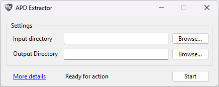
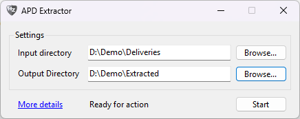
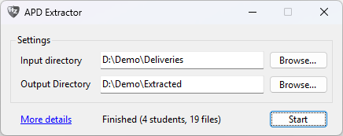
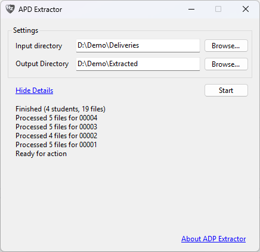
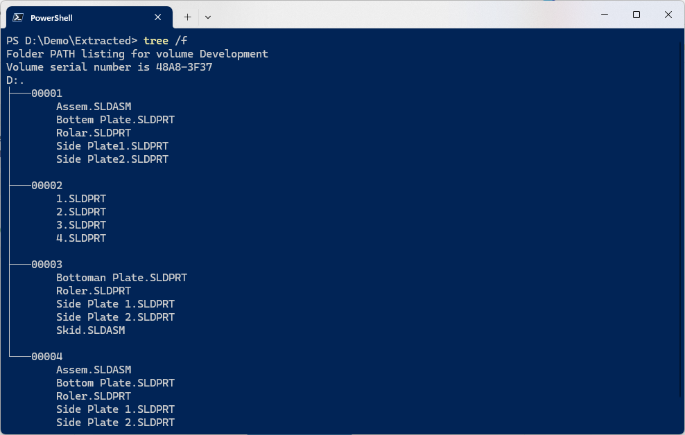

# Advanced Product Design Extractor

This tiny extrator application is used during the Advanced Product Design Course,
given at the Shanghai Maritime University by the HZ University of Applied Sciences.
During this course, students are asked to create a product design through SolidWorks.
After delivering the designs, the teacher get a zip file with all the designs,
containing a zip file per student.
This application flattens this into a folder per student, containing all their files.
This allows the application GraderWorks to automatically grade the designs.

During the extraction, the applications deals with different scenario's of delivery structure.
Nested zip and rar files are supported, as well as nested folder structures.
Non-SolidWorks files are ignored, since they are not relevant for the grading process.

## Installation

The application is written in C# and can be run on Windows, targeting `.Net 8.0`.
Before and including version 1.1.0, an active installation of the target framework is required.
Starting from version 1.1.1, there are two options in the release section:

- A standalone executable, which can be run without any installation.
- A minimised zip file, which contains the executable and a configuration file.
  This does require the installation of the target framework.

## Usage

The usage of the application is best shown through an example.
Let's imagine that a class of three students has delivered their designs.
There are three zip files, each with a different structure.

- **00001-Jimmaphy.zip**
	- 00001-Jimmy
		- 00001-Jimmaphy.zip
			- 5 SolidWorks files
		- Jimmaphy.doc
- **00002-Jimmy.zip**
	- 00002-Jimmy
		- 5 SolidWorks files
- **00003-Manaphy.zip**
	- Manaphy.doc
	- Manaphy.zip
		- 5 SolidWorks files
- **00004-Jim.zip**
	- Jim.doc
	- Jim.zip
		- Jim
			- 5 SolidWorks files

When the user launches the application, the main window appears.
Here, the user can select the folder where the zip files are located,
and the folder where the extracted files should be placed.
It is perfectly fine to select the same folder for both,
since the application ignores everything in the root that is not a zip-file.

After selecting the folders, the user can press the `Start` button.
Which will extract all the files and place them in the correct folders.
The status indicator in the center of the bottom of the window will indicate the progress.
Clicking 'More details' will show the user the full log of the application.

The results of the extraction will be stored per student,
retaining the student number in the folder name.
All their SolidWorks files will be placed in this folder.
The output for the sketched scenario is as follows.

